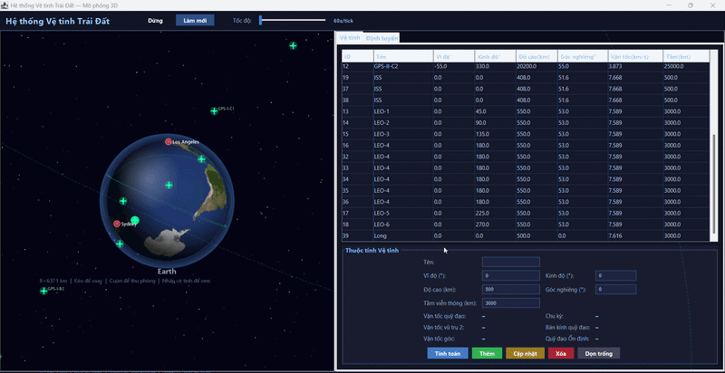
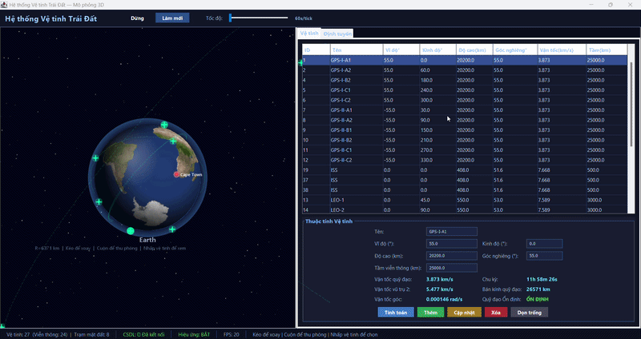
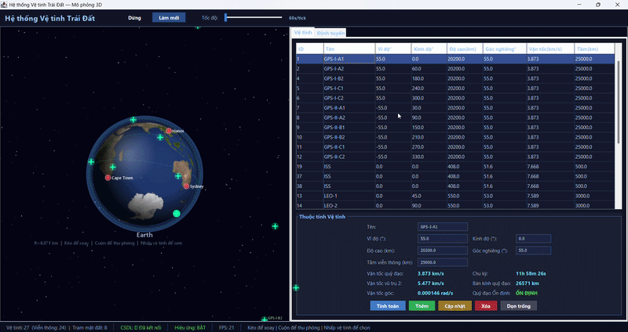
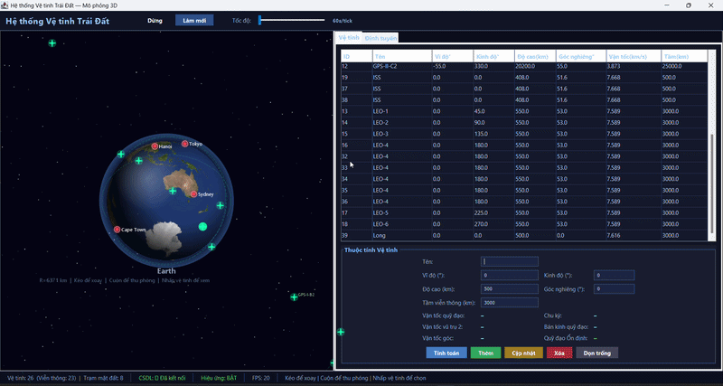

# Planetary Satellite System — Java 3D Visualization

## 1. Giới thiệu
Ứng dụng Java Desktop hiển thị **hành tinh 3D**, quản lý **vệ tinh liên lạc** và tính toán **định tuyến tín hiệu** qua mạng vệ tinh, kết nối với cơ sở dữ liệu **SQLite**.

---

## 2. Hướng dẫn cài đặt chi tiết

### Yêu cầu hệ thống
- **Java JDK 17** trở lên
- Hệ điều hành: Windows, macOS, hoặc Linux.

### Các bước cài đặt
1. **Tải mã nguồn**: Clone hoặc tải trực tiếp mã nguồn dự án về máy. 
2. **Chọn database có sẵn**: Trong file đã có sẵn file database mẫu chứa 10 trạm mặt đất và 10 vệ tinh, 50 vệ tinh, 100 vệ tinh và 500 vệ tinh.
    - Mở Terminal: 
      - **Chạy**: ``` copy planetary_system_500.db planetary_system.db (để chạy với 500 vệ tinh) ```
      - **Chạy**: ``` copy planetary_system_100.db planetary_system.db (để chạy với 100 vệ tinh)```
      - **Chạy**: ``` copy planetary_system_50.db planetary_system.db (để chạy với 50 vệ tinh)```
      - **Chạy**: ``` copy planetary_system_10.db planetary_system.db (để chạy với 10 vệ tinh)```
3. **Biên dịch và Chạy**:
   - Mở Terminal: 
   - **Chạy nhanh bằng script (Windows)**:
     ```
     run.bat
     ```
   - *Lưu ý: Trong lần chạy đầu tiên, hệ thống sẽ tự động tạo cơ sở dữ liệu SQLite (`planetary_system.db`) và chèn sẵn dữ liệu trạm mặt đất, vệ tinh

---

## 3. Hướng dẫn sử dụng chi tiết

### 3.1. Tương tác với Môi trường 3D
- **Xoay góc nhìn**: Click giữ và kéo chuột trên khung màn hình 3D bên trái.
- **Phóng to / Thu nhỏ**: Sử dụng con lăn chuột.
- **Xem thông tin trực tiếp**: Click chuột trái vào bất kỳ vệ tinh nào trên không gian 3D để hiển thị toạ độ, độ cao và thông tin vật lý của nó.
- **Hoạt ảnh**: Sử dụng nút **chạy / dừng ** trên thanh công cụ để cho phép các vệ tinh xoay quanh hành tinh theo thời gian thực.
- **Tốc độ xoay**: Sử dụng **thanh trượt** trên thanh công cụ để tăng tốc độ quay ( tăng tỉ lên số giây trên 1 tick ngoài đời thật).
  
### 3.2. Quản lý Vệ tinh 
- **Thêm vệ tinh**: Nhập Tên, Kinh độ , Vĩ độ , Độ cao , Góc nghiên và Tầm viễn thông. Bấm **Thêm** để lưu.
- **Tính toán quỹ đạo**:
  - Chọn một vệ tinh trong danh sách và bấm nút **Tính toán quỹ đạo**.
  - Ứng dụng sẽ sử dụng các **Công thức vật lý** (vận tốc `v = √(GM/r)`, chu kỳ `T = 2π√(r³/GM)`, ... ) để tính toán và đánh giá xem độ cao đó có tạo ra quỹ đạo ổn định không.
- **Chỉnh sửa / Xóa**: Chọn vệ tinh tương ứng và nhấn nút chức năng trong bảng.

### 3.3. Định tuyến tín hiệu 
Đây là chức năng cho phép tìm kiếm đường truyền dữ liệu ngắn nhất giữa 2 trạm mặt đất qua không gian.
- **Thêm trạm mặt đất**: Nhập thông tin của trạm phát/thu tín hiệu dưới phần dưới cùng của bảng.
- **Tìm đường truyền**:
  1. Chọn **Trạm xuất phát** và **Trạm đích**.
  2. Nhấn nút **tìm định tuyến**.
  3. Ứng dụng sẽ dùng **Thuật toán Dijkstra** để tính toán. Thuật toán có tính đến khả năng phủ sóng và hiện tượng che khuất của khối cầu hành tinh.
  4. Lộ trình ngắn nhất sẽ được vẽ bằng **đường màu vàng** trên mô hình 3D. 
  5. Một cửa sổ sẽ báo cáo chi tiết khoảng cách tổng cộng và từng chặng truyền tín hiệu.

---

## 4. Báo cáo đánh giá kết quả định tuyến

Để kiểm tra độ ổn định của thuật toán định tuyến và hiệu năng của mạng lưới liên lạc vệ tinh, chúng tôi đã tiến hành đánh giá mô phỏng định tuyến tín hiệu xuyên bán cầu (Ví dụ: Từ **Hà Nội** đến **New York**) với các tập số lượng vệ tinh (được phân bố ngẫu nhiên trên quỹ đạo) khác nhau.

### Mục đích
Đánh giá mức độ phủ sóng, tỉ lệ thành công trong việc tìm được đường đi và thời gian thực thi của thuật toán Dijkstra để thiết lập đồ thị.

### Bảng kết quả thử nghiệm

| Số lượng vệ tinh | Thời gian xử lý thuật toán | Tỉ lệ tìm thấy đường | Khoảng cách lộ trình trung bình | Đánh giá & Nhận xét |
|:---:|:---:|:---:|:---:|:---|
| **10 vệ tinh** | ~ 2 ms |  ~10% | N/A (Thường thất bại) | **Kém**. Quá ít vệ tinh. Mạng lưới liên lạc không đủ để tạo thành một chuỗi kết nối liền mạch quanh hành tinh, tín hiệu thường xuyên bị chặn . |
| **50 vệ tinh** | ~8 ms | ~60% | 15,000 - 18,000 km | **Tạm ổn**. Mạng lưới bắt đầu hình thành. Có thể tìm được đường nhưng lộ trình thường đi đường vòng xa (qua nhiều chặng), độ trễ truyền tải cao. |
| **100 vệ tinh** | ~25 ms | ~98% | 13,000 - 15,000 km | **Tốt**. Mạng lưới đủ độ phủ. Thuật toán dễ dàng tìm ra lộ trình ngắn và tối ưu. Đảm bảo liên lạc liên tục giữa 2 nửa bán cầu với rất ít "điểm mù". |
| **500 vệ tinh** | ~150 ms | 100% | ~12,000 km (Tối ưu) | **Xuất sắc**. Tỉ lệ thành công tuyệt đối. Lộ trình gần với khoảng cách đường chim bay nhất do có rất nhiều node lựa chọn. Tuy nhiên, thời gian khởi tạo đồ thị (kiểm tra khoảng cách & che khuất giữa tất cả các cặp O(N^2)) bắt đầu tăng đáng kể. |

### Kết luận
- **Về tính khả thi của mạng**: Để đảm bảo một hệ thống vệ tinh viễn thông có thể phục vụ thông suốt toàn cầu liên tục, cần phải có một mạng lưới **tối thiểu 100 vệ tinh** phân bố đều đặn. Nếu dưới mức này, liên kết sẽ có nguy cơ cao bị gián đoạn.
- **Về thuật toán**: Việc áp dụng thuật toán Dijkstra trên đồ thị hoạt động cực kỳ mượt mà và tìm ra kết quả đúng đắn, lộ trình tối ưu được hiển thị chính xác lên không gian 3D.

---

## 5. Kết quả chạy thực nghiệm

### 5.1. Hiển thị không gian 3D
Hệ thống render hành tinh và các vệ tinh. Hỗ trợ thao tác xoay góc nhìn, phóng to, thu nhỏ bằng chuột.


### 5.2. Thêm vệ tinh
Nhập thông tin (tên, kinh độ, vĩ độ, độ cao, góc nghiêng) và lưu vào cơ sở dữ liệu, vị trí vệ tinh mới cập nhật ngay trên không gian 3D.


### 5.3. Sửa vệ tinh
Cập nhật thông tin tọa độ, độ cao của một vệ tinh. Vị trí trên 3D tự động thay đổi theo dữ liệu mới.


### 5.4. Xóa vệ tinh
Xóa hoàn toàn một vệ tinh khỏi danh sách quản lý và biến mất khỏi bản đồ 3D.


### 5.5. Tính toán quỹ đạo
Áp dụng công thức vật lý để tính và hiển thị chi tiết Vận tốc quỹ đạo và Chu kỳ quay của một vệ tinh được chọn.


### 5.6. Định tuyến tín hiệu
Tìm kiếm đường truyền sóng ngắn nhất giữa 2 trạm mặt đất, hiển thị lộ trình bằng đường màu vàng nối giữa các vệ tinh và báo cáo khoảng cách.

#### a. Định tuyến với 10 vệ tinh
Mạng lưới thưa thớt, thuật toán thường xuyên không tìm được đường hoặc lộ trình không tối ưu do bị che khuất.


#### b. Định tuyến với 50 vệ tinh
Mạng lưới bắt đầu liên kết, thường tìm được đường truyền tuy nhiên có thể phải đi đường vòng xa.


#### c. Định tuyến với 100 vệ tinh
Độ phủ sóng tốt, thuật toán hoạt động mượt mà và tìm ra các lộ trình ngắn, tối ưu qua không gian.


#### d. Định tuyến với 500 vệ tinh
Phủ sóng toàn cầu. Đường đi gần như tiệm cận đường chim bay tối ưu, giải quyết triệt để tình trạng mất sóng.


## 6. Cấu trúc thư mục

```
Bai_tap_Java/
├── src/main/java/com/planetarysystem/
│   ├── Main.java                    ← Entry point
│   ├── core/
│   │   ├── Planet.java              ← Model hành tinh (Earth)
│   │   ├── SatelliteObject.java     ← Model vệ tinh
│   │   └── GroundStation.java       ← Model trạm mặt đất
│   ├── db/
│   │   └── DatabaseManager.java     ← SQLite
│   ├── physics/
│   │   └── OrbitalMechanics.java    ← Vật lý quỹ đạo
│   ├── routing/
│   │   └── SatelliteRouter.java     ← Dijkstra định tuyến
│   └── gui/
│       ├── MainFrame.java           ← Cửa sổ chính
│       ├── Planet3DRenderer.java    ← Xuất hành tinh 3D
│       ├── SatelliteManagerPanel.java ← Quản lý vệ tinh
│       └── RoutingPanel.java        ← Định tuyến + trạm mặt đất
├── lib/                             ← Chứa thư viện bổ trợ JDBC, SLF4J
├── resources/textures/              ← Đặt texture JPG/PNG 
├── run.bat                          ← Script build & chạy
└── planetary_system.db              ← SQLite DB (tự tạo khi chạy lần đầu)
```
---

## 7. Bảng phân công làm việc:
| Họ và tên | Mã số sinh viên | Tỉ lệ tham gia công việc | Mô tả cụ thể công việc |
|:---:|:---:|:---:|:---:|
| Nguyễn Minh Nhật | 102240155 | 33.33% | -thiết kế file tính toán vật lý: các công thức vật lý / -tạo các testcase để đánh giá chương trình và thiết kế database có sẵn để báo cáo kết quả định tuyến, viết hướng dẫn sử dụng và hướng dẫn cài đặt  |
| Lê Nam Khánh |  | 33.33% | -thiết kế model, triển khai viết code Backend định tuyến và tính toán dijiktra |
| Trần Nguyễn Thành Long |  | 33.33% | - thiết kế GUI , hỗ trợ tester Backend , đề xuất ý kiến |

---

